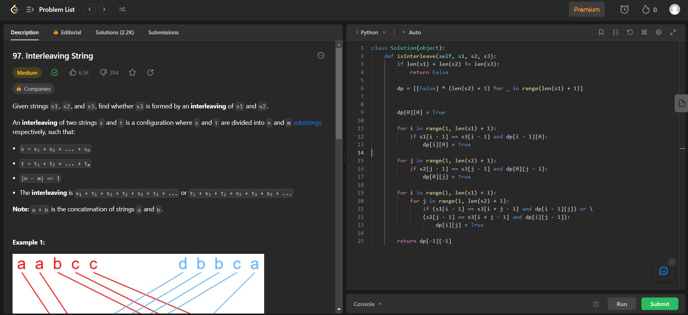

# PD_Exercicios_Dupla42

**Número da Lista**: 42<br>
**Conteúdo da Disciplina**: Programação Dinâmica<br>

## Alunos
|Matrícula | Aluno |
| -- | -- |
| 19/0118555  |  Wengel Rodrigues Farias |


## Sobre 
Este projeto foi feito com a resolução de 3 exercícios abordando o tema de Programação Dinâmica. Os exercícios foram retirados do site: [LeetCode](https://leetcode.com/).

## Screenshots

### Exercicio 1 - Climbing Stairs


Link: [Climbing Stairs](https://leetcode.com/problems/climbing-stairs/) <br>
Dificuldade: Fácil


### Exercicio 2 - Interleaving String

Link: [Interleaving String](https://leetcode.com/problems/interleaving-string/) <br>
Dificuldade: Médio



### Exercicio 3 - Regular Expression Matching

Link: [Regular Expression Matching](https://leetcode.com/problems/regular-expression-matching/) <br>
Dificuldade: Difícil


## Instalação 
**Linguagem**: Python<br>

Caso queira testar localmente é necessário instalar python:

- ### Windows
Baixe o pacote Python do [site official](https://www.python.org/downloads/), e no momento da instação, marque a opção "Add Python to PATH".

- ### Linux
Execute no terminal do linux a atualização dos pacotes e instalação do python3

```bash
sudo apt-get update
sudo apt-get install python3
```


## Uso 
Para verificar o funcionamento basta abrir o link do exercicio e copiar o código referente a questão, e logo após realizar o envio. Caso queira verificar localmente, é necessário executar o programa, e para isto basta utilizar o comando:

`python NomeDoArquivo.py`.


## Video da Apresentação

[Link do Vídeo](apresentacao.mp4)
